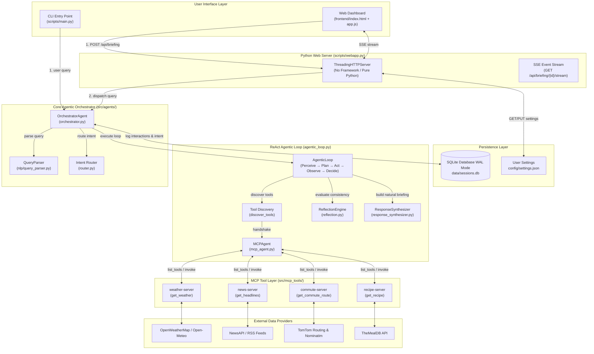

# Commute Commander — Complete End-to-End Architecture & Workflow Documentation

> **Document Purpose**: Comprehensive technical reference mapping every layer of Commute Commander — from User Interfaces (CLI & Web Dashboard) through NLP Parsing, the ReAct Agentic Loop, MCP Tool Servers, External API Fallback Chains, Cross-Section Reflection, and SQLite Persistence.

---

## 1. High-Level System Architecture Diagram



---

## 2. Comprehensive End-to-End Workflow Breakdown

### A. CLI Workflow (`scripts/main.py`)

1. **Initialization**: User runs `python scripts/main.py`. The CLI prompts for a `user_id` (defaults to `"guest"`).
2. **Session Creation**: `SessionManager.start_session(user_id)` generates a unique session ID (e.g. `shubh-20260812183000`).
3. **Query Input**: User types a natural language query (e.g., `commute plan from hyderabad to mumbai`).
4. **Orchestrator Dispatch**: `main.py` calls `orchestrator.run(query, session_id)`.
5. **Agentic ReAct Loop**: `run()` delegates to `run_agentic()`, which runs the 8-step Agentic Loop (see §3 below).
6. **Tool Discovery & Call**: Connects to `commute-server`, discovers `get_commute_route`, geocodes Hyderabad → Mumbai, calls TomTom API, receives routing & polyline data.
7. **Reflection & Synthesis**: Checks cross-section data for warnings, synthesizes a friendly natural language response.
8. **Output Display**: `main.py` prints the natural-language summary directly to the terminal console.

---

### B. Web Dashboard Workflow (`scripts/webapp.py` + `frontend/`)

1. **Initial POST (`POST /api/briefing`)**:
   - User types query in `frontend/index.html` and submits.
   - `app.js` sends `POST /api/briefing` with `{query, user_id}`.
   - `webapp.py` spawns a daemon thread with a 45-second timeout and calls `orchestrator.run_agentic()`.
   - `SQLiteSessionManager` persists intent to `data/sessions.db`.
   - API returns structured JSON containing:
     - `session_id`
     - `intent` (location, destination, sections, ingredients, time_constraint)
     - `sections` (structured cards data for weather, news, commute, breakfast)
     - `loop_trace` (array of `step`, `thought`, `action`, `observation`, `duration_ms`)
     - `reflection` (`changes_made`, `confirmations`)
     - `summary` (friendly natural-language briefing)
     - `tools_discovered` (server → tools list)

2. **Progressive SSE Streaming (`GET /api/briefing/{session_id}/stream`)**:
   - Immediately after the POST, `app.js` opens an `EventSource` connection to `/api/briefing/{id}/stream`.
   - `webapp.py` launches parallel `threading.Thread` instances for each agent.
   - Results are collected in a `queue.Queue`.
   - As each agent finishes fetching data, an SSE event (`data: {"section":"weather", ...}\n\n`) is flushed to the browser.
   - `app.js` receives each event and dynamically updates that specific card in real-time (no waiting for the slowest API).
   - Server flushes `data: {"event": "done"}` to close the stream.

3. **Leaflet Map Rendering**:
   - The `commute` section payload includes origin `[lat, lon]`, destination `[lat, lon]`, distance, ETA, traffic alerts, and Leaflet polyline arrays `[[lat, lon], ...]`.
   - `app.js` initializes Leaflet 1.9.4 and renders the live purple route line with origin/destination markers and dashed alternate routes.

4. **Card Management Endpoints**:
   - **Single Card Refresh**: `POST /api/briefing/{id}/{section}/refresh`
   - **Re-run All**: `POST /api/briefing/{id}/rerun`
   - **Save/Pin Briefing**: `POST /api/briefing/{id}/save`
   - **History**: `GET /api/history` & `GET /api/history/{id}`
   - **Settings**: `GET /api/settings` & `PUT /api/settings`

---

## 3. The 8-Step ReAct Agentic Loop Detail

The core agentic execution engine resides in [agentic_loop.py](file:///c:/Users/ShubhamKumar/Desktop/L2-Project/src/agents/agentic_loop.py):

```
┌─────────────────────────────────────────────────────────────────────────────┐
│ 1. PERCEIVE  │ QueryParser extracts location, destination, sections, etc.   │
├──────────────┼──────────────────────────────────────────────────────────────┤
│ 2. DISCOVER  │ MCPAgent.connect() handshakes with all 4 FastMCP servers    │
├──────────────┼──────────────────────────────────────────────────────────────┤
│ 3. PLAN      │ Router maps requested sections to server tool dispatch queue │
├──────────────┼──────────────────────────────────────────────────────────────┤
│ 4. ACT       │ MCPAgent.invoke(tool_name, **kwargs) calls FastMCP tool      │
├──────────────┼──────────────────────────────────────────────────────────────┤
│ 5. OBSERVE   │ Raw tool response is shaped into standard typed Card format │
├──────────────┼──────────────────────────────────────────────────────────────┤
│ 6. DECIDE    │ Loop checks if sections remain or MAX_ITERATIONS (8) reached │
├──────────────┼──────────────────────────────────────────────────────────────┤
│ 7. REFLECT   │ ReflectionEngine applies 5 cross-section consistency rules   │
├──────────────┼──────────────────────────────────────────────────────────────┤
│ 8. RESPOND   │ ResponseSynthesizer creates friendly natural language output │
└─────────────────────────────────────────────────────────────────────────────┘
```

### Trace Step Schema (`loop_trace`):
Every iteration logs a step entry in the JSON response:
```json
{
  "step": 1,
  "thought": "I need weather data. Server 'weather' exposes ['get_weather']. I'll call 'get_weather' with {'location': 'Chicago'}.",
  "action": "weather.get_weather",
  "action_args": { "location": "Chicago" },
  "observation": "Got weather: 28.0°C, UV 5.2, condition: Hot & Sunny.",
  "duration_ms": 1234
}
```

---

## 4. MCP Tools & Specialist Agents Mapping

| MCP Server | Exposed Tools | Specialist Agent | External APIs Called & Fallback Cascade |
|---|---|---|---|
| `weather-server` | `get_weather(location)` | `WeatherAgent` | **OpenWeatherMap** → **Open-Meteo** (Current + Hourly) → Synthetic 5-point curve |
| `news-server` | `get_headlines()` | `NewsAgent` | **NewsAPI** → **BBC RSS** → **NDTV RSS** → **NYT RSS** |
| `commute-server` | `get_commute_route(from, to, mode)`<br>`get_commute_advice(location)` | `CommuteAgent` | **TomTom Geocoding & Routing** → **OSM Nominatim** → **Open-Meteo Geocode** → **ORS** → Advisory Calculation |
| `recipe-server` | `get_recipe(ingredients, time)` | `BreakfastAgent` | **TheMealDB API** → Scrambled Eggs Fallback |

---

## 5. Cross-Section Reflection Engine Rules

The Reflection Engine ([reflection.py](file:///c:/Users/ShubhamKumar/Desktop/L2-Project/src/agents/reflection.py)) evaluates cross-domain consistency after tool data is collected:

| # | Rule Name | Trigger Condition | System Action / Mutation |
|---|---|---|---|
| **1** | **Extreme Heat + Outdoor Commute** | `temp ≥ 35°C` & mode = `bike`/`walk` | Mutates commute mode to `drive`, adds alert: *"Extreme heat (38°C) — switched recommendation from bike to drive for safety."* |
| **2** | **Freezing Weather + Walking** | `temp ≤ 2°C` & mode = `walk`/`bike` | Adds alert: *"Freezing conditions (0°C) — bundle up warmly for walking, or consider driving."* |
| **3** | **High UV Protection Warning** | `uv_index ≥ 8` & mode = `bike`/`walk` | Adds alert: *"UV index is very high (9.2) — wear sunscreen and a hat for your bike commute."* |
| **4** | **Long Commute + Slow Breakfast** | `eta ≥ 45 min` & `prep ≥ 15 min` | Attaches `reflection_note`: *"Your commute is 50 min — consider a quicker 5-minute breakfast to save time."* |
| **5** | **Hot Weather + Hot Meal Pairing** | `temp ≥ 30°C` & recipe contains "hot" | Attaches `reflection_note`: *"It's 32°C outside — a cold or light breakfast might be more refreshing."* |

---

## 6. Persistence & Storage Architecture

### SQLite Database (`data/sessions.db`)
Configured in Write-Ahead Logging (WAL) mode for multi-threaded read/write safety:

```sql
-- Sessions table
CREATE TABLE sessions (
    session_id    TEXT PRIMARY KEY,       -- e.g. "shubh-20260812183000"
    user_id       TEXT NOT NULL,          -- e.g. "shubh" or "guest"
    created_at    TEXT NOT NULL,          -- ISO 8601 UTC string
    saved         INTEGER NOT NULL,       -- 0 = temporary, 1 = pinned/saved
    saved_at      TEXT,                   -- ISO 8601 UTC string when pinned
    intent        TEXT,                   -- JSON blob: {location, sections, ingredients, ...}
    last_sections TEXT                    -- JSON blob: full section card payloads
);

-- Interactions table
CREATE TABLE interactions (
    id            INTEGER PRIMARY KEY AUTOINCREMENT,
    session_id    TEXT NOT NULL,
    data          TEXT NOT NULL,          -- JSON blob: query, trace, response metadata
    timestamp     TEXT NOT NULL           -- ISO 8601 UTC string
);
```

### Settings File (`config/settings.json`)
Managed by `SettingsManager` with strict validation rules on write:
```json
{
  "default_location": "Chicago, IL",
  "units": "metric",
  "default_sections": ["weather", "commute", "news", "breakfast"],
  "news_categories": ["general"]
}
```
