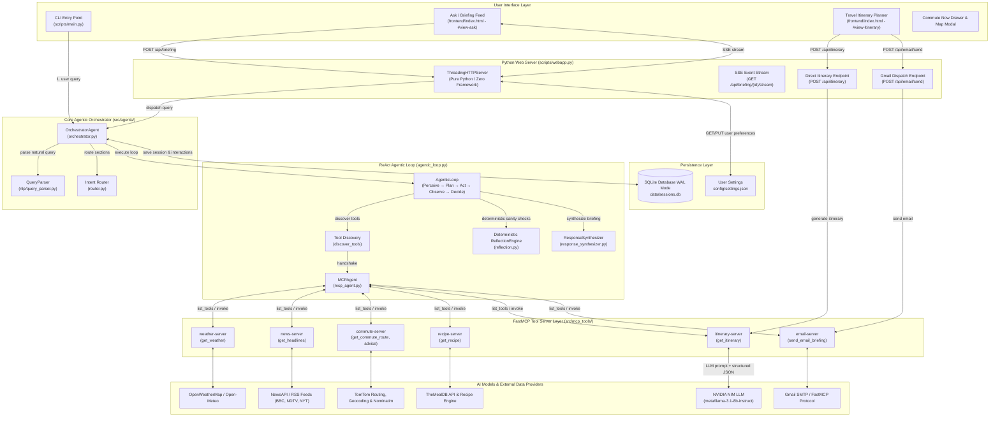

# Commute Commander — Complete End-to-End Architecture & Workflow Documentation

> **Document Purpose**: Comprehensive technical reference mapping every layer of Commute Commander — from User Interfaces (CLI & Web Dashboard) through NLP Intent Parsing, the ReAct Agentic Loop, FastMCP Tool Servers, NVIDIA NIM LLM Integration, External API Fallback Chains, Deterministic Cross-Section Reflection, and SQLite Persistence.

---

## 1. High-Level System Architecture Diagram



---

## 2. Comprehensive End-to-End Workflow Breakdown

### A. Natural Language Briefing Flow (`POST /api/briefing`)

1. **User Query Input**:
   - The user inputs a query via Web Dashboard or CLI (e.g. `"Commute from Mumbai to BKC, weather, headlines, and quick breakfast"` or `"Itinerary for Srinagar for 3 days"`).
2. **NLP Intent Parsing ([`src/nlp/query_parser.py`](file:///c:/Users/ShubhamKumar/Desktop/L2-Project/src/nlp/query_parser.py))**:
   - Normalizes text, matches keyword patterns, and extracts entities:
     - `location`: Origin/Current location (e.g. `"Mumbai"` or `"Srinagar"`).
     - `destination`: Commute target if specified (e.g. `"BKC"`).
     - `sections`: List of requested domains (`["weather", "commute", "news", "breakfast", "itinerary"]`).
     - `days`: Duration for travel requests (e.g. `3`).
     - `budget`: Financial preference (`"budget"`, `"moderate"`, `"luxury"`).
3. **Agentic ReAct Loop Execution ([`src/agents/agentic_loop.py`](file:///c:/Users/ShubhamKumar/Desktop/L2-Project/src/agents/agentic_loop.py))**:
   - Discovers active FastMCP servers and maps section targets to tool calls.
   - Executes tools sequentially or in parallel, shaping raw tool data into standardized typed Card payloads.
4. **Deterministic Cross-Section Reflection ([`src/agents/reflection.py`](file:///c:/Users/ShubhamKumar/Desktop/L2-Project/src/agents/reflection.py))**:
   - Evaluates collected data across domains for safety and optimization (e.g., switches bike commute to drive in extreme heat, flags freezing temperatures, pairs light breakfast with hot weather).
5. **Real-time SSE Streaming & Progressive UI Updates**:
   - `webapp.py` opens an SSE stream (`/api/briefing/{id}/stream`).
   - Cards pop in dynamically as each specialist agent completes its task.
   - `app.js` updates metrics, graphs, and the dynamic commute map without full-page reloads.

---

### B. Travel Itinerary Planner Workflow (`POST /api/itinerary` & `#view-itinerary`)

1. **Dedicated View Interaction**:
   - User switches to the Itinerary Planner via the left sidebar (`view-itinerary`).
   - The user can click preset destination chips (`🏔️ Srinagar`, `🏖️ Bali`, `⛩️ Tokyo`, `🌴 Goa`, `🗼 Paris`, `🏛️ Rome`, `🕌 Dubai`, `🗽 New York`) or type any global destination.
   - Selects duration pills (`1D`–`7D`) and budget level (`🎒 Budget`, `⚖️ Moderate`, `👑 Luxury`).
2. **Direct API Dispatch**:
   - `frontend/app.js` displays an immediate animated skeleton card.
   - Sends payload `{ location, days, budget }` directly to `POST /api/itinerary` (with automatic fallback to `/api/briefing`).
3. **NVIDIA NIM LLM Reasoning ([`src/mcp_tools/itinerary_tools.py`](file:///c:/Users/ShubhamKumar/Desktop/L2-Project/src/mcp_tools/itinerary_tools.py))**:
   - `LLMClient` sends a structured prompt to NVIDIA NIM (`meta/llama-3.1-8b-instruct`).
   - Applies regex cleanup to strip markdown fences and sanitize trailing commas before JSON parsing.
   - Generates structured day-by-day itineraries with themes, morning/afternoon/evening activities, landmark names, authentic dining spots, and local travel tips.
4. **Interactive UI Rendering & Actions**:
   - **Native Block Scrolling**: `#view-itinerary` uses `display: block !important; overflow-y: auto !important; height: calc(100dvh - 65px);` to ensure multi-day cards scroll smoothly.
   - **Interactive Day Filter Tabs**: Filter between `[✨ All Days]` and individual `[Day 1]`...`[Day N]` tabs.
   - **Copy to Clipboard**: `copyItineraryText()` copies a formatted markdown schedule to clipboard.
   - **Gmail FastMCP Dispatch**: Opens modal to send the itinerary via authenticated email tool.

---

### C. Dynamic Live Commute Map Architecture

1. **Reset & Clean State Across Queries**:
   - Upon submitting any new query, `resetCommuteMap()` clears `_routeLayer` and `_altLayers`, hides badges, and hides `#commute-map` (`class="commute-map hidden"`).
   - If the query does **not** contain a commute section (e.g. pure itinerary or weather), `#commute-map` remains hidden, displaying a clean text placeholder (*"No commute route in this query"*), preventing stale map tiles or markers from lingering.
2. **Live Routing & Polyline Fitting**:
   - When real route coordinates arrive, `renderCommuteMap(data)` unhides `#commute-map`, initializes Leaflet 1.9.4, adds start and destination SVG markers, draws the main purple polyline with dashed alternate routes, fits bounds with padding, and displays the `Live · TomTom` / `Live · ORS` / `Advisory` source badge.
3. **Commute Drawer & Main Sidebar Synchronization**:
   - Route calculations made inside the **Commute Now** drawer (`calculateDrawerRoute()`) automatically synchronize state and update the main live map widget in the right sidebar.

---

## 3. FastMCP Tools & Specialist Agents Matrix

| FastMCP Server | Exposed Tool Functions | Specialist Agent | Data Providers & Cascade Chain |
|---|---|---|---|
| **`weather-server`** | `get_weather(location)` | `WeatherAgent` | **OpenWeatherMap** $\rightarrow$ **Open-Meteo** (Current + Hourly) $\rightarrow$ Heuristic 5-point curve |
| **`news-server`** | `get_headlines(category)` | `NewsAgent` | **NewsAPI** $\rightarrow$ **BBC RSS** $\rightarrow$ **NDTV RSS** $\rightarrow$ **NYT RSS** |
| **`commute-server`** | `get_commute_route(from, to, mode)`<br>`get_commute_advice(location)` | `CommuteAgent` | **TomTom Routing & Geocoding** $\rightarrow$ **OSM Nominatim** $\rightarrow$ **Open-Meteo Geocode** $\rightarrow$ **ORS** $\rightarrow$ Synthetic Advisory |
| **`recipe-server`** | `get_recipe(ingredients, time)` | `BreakfastAgent` | **TheMealDB API** $\rightarrow$ Scrambled Eggs & Toast Fallback |
| **`itinerary-server`** | `get_itinerary(location, days, budget)` | `ItineraryAgent` | **NVIDIA NIM LLM (`meta/llama-3.1-8b-instruct`)** $\rightarrow$ Rich Knowledge Base Engine |
| **`email-server`** | `send_email_briefing(to, subject, body)` | `EmailAgent` | **Gmail SMTP / FastMCP Protocol** |

---

## 4. Deterministic Cross-Section Reflection Rules

The Reflection Engine ([`src/agents/reflection.py`](file:///c:/Users/ShubhamKumar/Desktop/L2-Project/src/agents/reflection.py)) evaluates cross-domain consistency in $<1\text{ ms}$ with deterministic logic:

| # | Rule Name | Trigger Condition | System Action / Mutation |
|---|---|---|---|
| **1** | **Extreme Heat + Outdoor Commute** | `temp ≥ 35°C` & mode in `("bike", "walk")` | Switched recommendation to `drive`, prepends alert: *"⚠️ Extreme heat (38°C) — switched recommendation from bike to drive for safety."* |
| **2** | **Freezing Weather + Walking** | `temp ≤ 2°C` & mode in `("walk", "bike")` | Adds alert: *"🥶 Freezing conditions (0°C) — bundle up warmly for walking, or consider driving."* |
| **3** | **High UV Protection Warning** | `uv_index ≥ 8` & mode in `("bike", "walk")` | Adds alert: *"☀️ UV index is very high (9.2) — wear sunscreen and a hat for your bike commute."* |
| **4** | **Long Commute + Slow Breakfast** | `eta ≥ 45 min` & `prep ≥ 15 min` | Attaches `reflection_note`: *"💡 Your commute is 50 min — consider a quicker 5-minute breakfast to save time."* |
| **5** | **Hot Weather + Hot Meal Pairing** | `temp ≥ 30°C` & recipe has `"hot"` | Attaches `reflection_note`: *"🌡️ It's 32°C outside — a cold or light breakfast might be more refreshing."* |

---

## 5. Web API Endpoints Reference

| HTTP Method | Route | Description |
|---|---|---|
| `POST` | `/api/briefing` | Orchestrates complete briefing via ReAct Agentic Loop, returns structured JSON. |
| `GET` | `/api/briefing/{id}/stream` | Server-Sent Events (SSE) stream emitting progressive card updates in real-time. |
| `POST` | `/api/briefing/{id}/{section}/refresh` | Refreshes a single section without re-running the full briefing. |
| `POST` | `/api/briefing/{id}/rerun` | Re-executes all sections using the stored session intent. |
| `POST` | `/api/briefing/{id}/save` | Pins and saves briefing to SQLite database. |
| `PATCH` | `/api/briefing/{id}/intent` | Updates and merges intent properties (e.g. location, budget, sections). |
| `POST` | `/api/itinerary` | Direct dedicated endpoint for instant multi-day travel itinerary generation. |
| `POST` | `/api/email/send` | Dispatches briefing or itinerary to recipient email via FastMCP Gmail tool. |
| `GET` | `/api/history` | Fetches the list of saved/recent morning briefing sessions. |
| `GET` | `/api/history/{id}` | Fetches full session interaction JSON for a specific session. |
| `DELETE` | `/api/history/{id}` | Deletes a session from SQLite database. |
| `GET` | `/api/settings` | Returns user preferences from `config/settings.json`. |
| `PUT` | `/api/settings` | Validates and updates user settings (units, default location, default sections). |

---

## 6. Persistence & Database Schema (`data/sessions.db`)

SQLite configured in **Write-Ahead Logging (WAL)** mode for concurrent multi-threaded read/write safety:

```sql
-- Sessions table
CREATE TABLE sessions (
    session_id    TEXT PRIMARY KEY,       -- e.g. "guest-20260817180000"
    user_id       TEXT NOT NULL,          -- e.g. "shubh" or "guest"
    created_at    TEXT NOT NULL,          -- ISO 8601 UTC timestamp
    saved         INTEGER NOT NULL,       -- 0 = temporary, 1 = pinned/saved
    saved_at      TEXT,                   -- ISO 8601 UTC timestamp when pinned
    intent        TEXT,                   -- JSON blob: {location, sections, days, budget, ...}
    last_sections TEXT                    -- JSON blob: complete rendered section card payloads
);

-- Interactions table
CREATE TABLE interactions (
    id            INTEGER PRIMARY KEY AUTOINCREMENT,
    session_id    TEXT NOT NULL,
    data          TEXT NOT NULL,          -- JSON blob: query, loop_trace, reflection metadata
    timestamp     TEXT NOT NULL           -- ISO 8601 UTC timestamp
);
```
